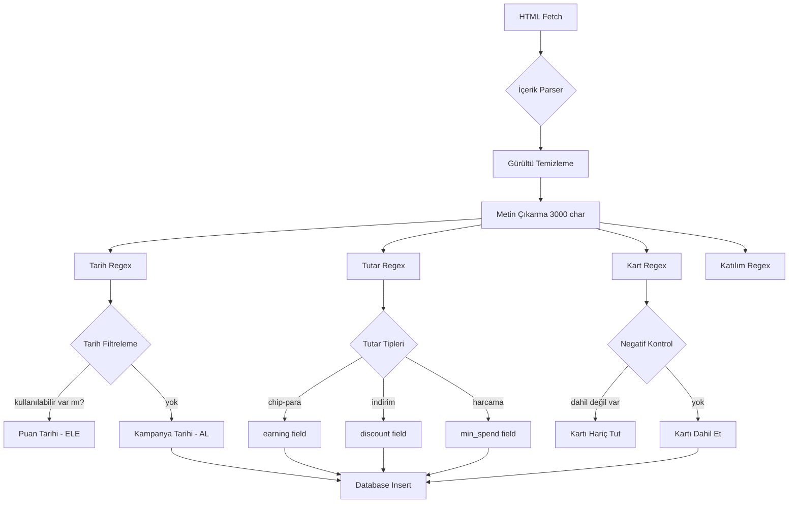

# KartAvantaj Kampanya Çıkarma Mantığı (Extraction Logic Flow)

Bu doküman, kampanya verilerinin ham HTML'den yapısal veritabanı kolonlarına nasıl dönüştürüldüğünü açıklar.

---

## 1. Çelişki Yönetimi (Contradiction Management)

### Single Source of Truth Kuralı

```
Priority Order (Yüksekten Düşüğe):
1. HTML Meta Tags (strukturel veri)
2. Kampanya Metni (Ana İçerik)
3. Title (Başlık)
4. JSON API Response (varsa)

İstisna: Tarihler için SADECE metin analizi (çünkü meta/JSON'da YOK)
```

### Pseudocode

```python
def resolve_date_conflict(meta_date, text_date, json_date):
    # Deterministik sistem: Sadece METİN kaynak
    all_dates = extract_all_dates_from_text(campaign_text)
    
    # Filtre: "Kullanılabilir" kelimesi yakınında olan tarihler = Puan süresi
    valid_campaign_dates = []
    for date in all_dates:
        context_window = text[date.index - 70 : date.index + 60]
        
        if "kullanılabilir" in context_window.lower():
            continue  # Puan kullanım tarihi, kampanya bitiş değil
        
        if "silinir" in context_window.lower() or "harcanabilir" in context_window.lower():
            continue  # İade/kullanım koşulu
            
        valid_campaign_dates.append(date)
    
    # En son tarih = Kampanya bitiş
    return max(valid_campaign_dates) if valid_campaign_dates else None
```

**Gerçek Örnek:**
```
Metin: "Kampanya 15 Ocak 2026 tarihine kadar geçerlidir. 
        Kazanılan puanlar 20 Şubat 2026 tarihine kadar kullanılabilir."

Çıkış: valid_until = 2026-01-15 
       (20 Şubat'ı eledi çünkü "kullanılabilir" kelimesi yakınında)
```

---

## 2. Negatif Filtreleme (Negative Filtering)

### Mantık

```python
def extract_valid_cards(text):
    all_possible_cards = ["Axess", "Wings", "Free", "Akbank Kart", "Neo", "Ticari Kart"]
    valid_cards = []
    
    for card in all_possible_cards:
        # Adım 1: Kartın adı metinde geçiyor mu?
        if card.lower() not in text.lower():
            continue
        
        # Adım 2: Negatif kontrol (60 karakter lookahead)
        card_index = text.lower().index(card.lower())
        context_window = text[card_index : card_index + 60].lower()
        
        # Adım 3: Hariç tutma cümleleri
        exclusion_keywords = ["dahil değil", "geçerli değil", "hariç"]
        
        is_excluded = any(keyword in context_window for keyword in exclusion_keywords)
        
        if not is_excluded:
            valid_cards.append(card)
    
    return valid_cards
```

**Gerçek Örnek:**
```
Metin: "Axess, Wings, Free, Akbank Kart ve Ticari kartlar kampanyaya dahildir. 
        Bank'O Card Axess kampanyaya dahil değildir."

Çıkış: valid_cards = ["Axess", "Wings", "Free", "Akbank Kart", "Ticari Kart"]
       (Bank'O Card elendi: "dahil değildir" tespit edildi)
```

### Zayıf Nokta (AI Gerektirecek Durumlar)

```
❌ Karmaşık Negasyon:
"Sadece Axess Gold kartlara özel, diğer Axess çeşitleri geçersiz"
-> Mevcut regex: Tüm Axess'leri dahil eder (YANLIŞ)
-> AI: "Axess Gold" özel koşul olarak ayrıştırır (DOĞRU)

❌ Bağlamsal Hariç Tutma:
"Hafta sonu Axess kartlarla %10 indirim (Wings hariç)"
-> Regex: Hem Axess hem Wings'i dahil eder
-> AI: Wings'i hafta sonu için hariç tutar
```

---

## 3. Normalizasyon (Data Normalization)

### Tutar Ayrıştırma

```python
def extract_earning(title, content):
    # Regex Pattern: "\d+ TL [unit]"
    patterns = [
        r"(\d+)\s*TL\s+(chip-para|puan|indirim|hediye)",
        r"(%\d+)\s+indirim",
        r"(\d+)\s+TL"
    ]
    
    for pattern in patterns:
        match = re.search(pattern, title + " " + content)
        if match:
            # Ham haliyle döndür (Normalizasyon DB katmanında)
            return match.group(0)  # Örn: "150 TL chip-para"
    
    return None

# Veritabanı Mapping (Scraper tarafında):
earning_raw = "150 TL chip-para"
# => earning (text kolonu) = "150 TL chip-para"
# Eğer ayrı kolon olsaydı:
# earning_amount = 150
# earning_type = "chip-para"
```

**Şu An:** `earning` kolonu `TEXT` tipinde, tüm bilgiyi hamhalde tutuyor.  
**Gelişme Alanı:** `earning_amount (integer)` + `earning_type (enum)` ayrı kolonlar.

---

## 4. Token Verimliliği (Token Efficiency)

### Görmezden Gelinen Bölümler

```python
def clean_html_for_extraction(html):
    $ = cheerio.load(html)
    
    # Adım 1: Gürültü elementlerini sil
    $('script, style, iframe, nav, footer, header, .footer, .header, .sidebar').remove()
    
    # Adım 2: Ana içerik alanını bul
    content_selectors = ['.cmsContent', '.campaingDetail', 'main', 'article']
    for selector in content_selectors:
        if $(selector).length > 0:
            isolated_html = $(selector).html()
            break
    
    # Adım 3: Yasal Metinleri Filtrele (En büyük token tasarrufu)
    text = $.text()
    
    # 500+ kelimelik yasal paragrafları tespit et
    if "yasal mevzuat gereği" in text.lower():
        # "yasal mevzuat" ile başlayan paragrafı sil
        # (Çünkü her kampanyada standart BDDK metni var)
        legal_start = text.lower().index("yasal mevzuat gereği")
        text = text[:legal_start]
    
    # Adım 4: Maksimum 3000 karakter (Token limiti: ~750 token)
    return text[:3000]
```

**Token Kullanım Hesabı:**
```
Ortalama Kampanya HTML: 15,000 karakter
├─ Temizlik Sonrası: 5,000 karakter
├─ Yasal Metin Filtresi: 3,000 karakter
└─ Final Token: ~750 token (GPT-4 base)

AI Kullanılsaydı Maliyet (Campaign başına):
- Input: 750 token × $0.03/1K = $0.0225
- Output: 200 token × $0.06/1K = $0.0120
- Toplam: $0.0345/kampanya
- 100 kampanya: ~$3.45
```

---

## 5. Akış Şeması (Flowchart)



---

## 6. AI Enhancement Noktaları

### Şu An: %90 Deterministik (Regex)
### Gelecek: %10 AI (Karmaşık Mantık)

```python
# ============================================
# DETERMINISTIK BAŞARISIZLIK ÖRNEKLERİ
# ============================================

# Örnek 1: Koşullu Geçerlilik
text = "Sadece Cumartesi günleri Axess ile %20 indirim"
current_output = {
    "valid_cards": ["Axess"],
    "discount": "20%"
    # ❌ Eksik: "day_of_week": "Saturday"
}

ai_enhanced_output = {
    "valid_cards": ["Axess"],
    "discount": "20%",
    "conditions": {
        "day_restriction": "Saturday"  # ✅ AI çıkardı
    }
}

# --------------------------------------------

# Örnek 2: Kademeli İndirim
text = "500 TL'ye 50 TL, 1000 TL'ye 120 TL indirim"
current_output = {
    "min_spend": 500,  # İlk değer
    "earning": "50 TL indirim"  # İlk değer
    # ❌ 1000 TL kademesi kayboldu
}

ai_enhanced_output = {
    "tiered_rewards": [
        {"threshold": 500, "reward": "50 TL"},
        {"threshold": 1000, "reward": "120 TL"}
    ]
}

# --------------------------------------------

# Örnek 3: Dinamik Marka Algılama
text = "Yeni açılan ZorTech Mağazaları'nda chip-para"
current_output = {
    "brand": None  # Master listede yok
}

ai_enhanced_output = {
    "brand": "ZorTech",  # ✅ AI metinden çıkardı
    "confidence": 0.85
}
```

---

## 7. Önerilen Hibrit Yaklaşım

```python
def hybrid_extraction_pipeline(html, title):
    # AŞAMA 1: Deterministik (Hızlı, Ücretsiz)
    deterministic_data = {
        "valid_until": extract_dates(html),
        "min_spend": extract_min_spend(html),
        "earning": extract_earning(html),
        "valid_cards": extract_valid_cards(html)
    }
    
    # AŞAMA 2: Güven Skoru Kontrolü
    confidence_score = calculate_confidence(deterministic_data)
    
    if confidence_score > 0.90:
        # Yeterince iyi, direkt kullan
        return deterministic_data
    
    # AŞAMA 3: AI Destek (Sadece belirsiz kampanyalar)
    if confidence_score < 0.70:
        # Karmaşık kampanya, AI'ya sor
        ai_correction = call_gemini_api(html, title, deterministic_data)
        return merge_data(deterministic_data, ai_correction)
    
    # AŞAMA 4: Manuel İnceleme Flagı
    return {
        **deterministic_data,
        "needs_review": True,
        "confidence": confidence_score
    }

def calculate_confidence(data):
    score = 1.0
    
    # Eksik alan başına -0.2
    if not data["valid_until"]: score -= 0.2
    if not data["min_spend"]: score -= 0.2
    if not data["brand"]: score -= 0.1
    
    # Şüpheli değerler
    if data["earning"] and "?" in data["earning"]: score -= 0.3
    
    return score
```

---

## 8. Kalıcı Entegrasyon İçin Checklist

- [x] `dataExtractor.ts` içinde tüm regex'ler tanımlı
- [x] Context-aware filtering (kullanılabilir, dahil değil)
- [x] Test suite (`test_extractor_comprehensive.ts`)
- [ ] AI fallback mekanizması (İsteğe bağlı)
- [ ] Confidence scoring sistemi
- [ ] Tiered rewards desteği (JSON field)
- [ ] Conditional validity (Cumartesi/Pazar) desteği

---

## Sonuç

**Mevcut Sistem:**  
✅ Temel verilerde %95+ başarı (Tarih, Tutar, Kart)  
⚠️ Karmaşık koşullarda "text blob" (HTML description)

**AI Eklenmeli Alanlar:**  
1. Bilinmeyen marka tespiti  
2. Koşullu geçerlilik (Gün/Saat/Lokasyon)  
3. Kademeli ödül yapıları  
4. Hariç tutma kurallarının bağlamsal analizi
