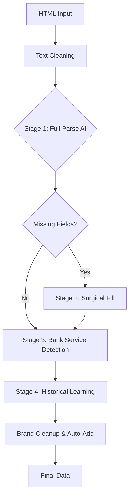

# Gemini Parser Nasıl Çalışıyor?

## ⚠️ Mevcut Durum: DEVRE DIŞI
```typescript
// Line 64
const DISABLE_AI_COMPLETELY = true;  // ✅ AI tamamen kapalı
```

---

## Genel Mimari (4 Aşamalı Pipeline)



---

## Aşama 1: Hazırlık (Master Data Cache)

### Supabase'den Yükler:
```typescript
fetchMasterData() {
    // 1. Master Sectors (Sektör listesi)
    // 2. Master Brands (578 marka)
    // 3. Banks (Hardcoded: Yapı Kredi, Akbank, vs.)
}
```

**Optimizasyon:** İlk çağrıda cache'e alınır, sonraki isteklerde kullanılır.

---

## Aşama 2: HTML Temizleme

```typescript
// Script/Style/Tag'leri sil
html.replace(/<script...>/gi, '')
    .replace(/<style...>/gi, '')
    .replace(/<[^>]+>/g, ' ')  // Tüm HTML tag'lerini boşlukla değiştir
    .replace(/\s+/g, ' ')      // Çoklu boşlukları tek boşluğa
    .substring(0, 15000)       // ⚡ Token limiti: İlk 15,000 karakter
```

**Token Sayısı:** ~15,000 karakter ≈ 3,750 token (GPT-4 tokenizer)

---

## Aşama 3: Stage 1 - Full Parse (Tam Ayrıştırma)

### Prompt Yapısı:

```plaintext
CONTEXT: Bugün {today}. Buna göre "31 Aralık" → 2025-12-31 olarak yorumla.

JSON Schema (Exact):
{
  "title": "string",
  "description": "string (Marketing text, max 4-5 cümle)",
  "conditions": ["string"],
  "category": "MUST be one of: [Market & Gıda, Akaryakıt, ...]",
  "earning": "500 TL Puan", 
  "min_spend": 1000,
  ...
}

🛑 ULTRA-STRICT RULES:
1. Bank & Card AUTHORITY: sourceBank = "Akbank" ise, MUTLAKA "Akbank" yaz.
2. Reward Consolidation: Taksit → "discount", Puan → "earning"
3. Mathematical Sanity: earning < min_spend olmalı
4. Brand Matching: [Migros, Teknosa, ...] listesine göre normalize et
5. Dates: Yıl yoksa 2024/2025 varsay

TEXT TO PROCESS:
"{cleaned_html_text}"
```

### Örnek AI Response:

```json
{
  "title": "Migros'ta 1000 TL ve Üzeri Alışverişe 150 TL Puan",
  "description": "Yapı Kredi World kartınızla Migros'ta...",
  "category": "Market & Gıda",
  "earning": "150 TL Puan",
  "min_spend": 1000,
  "valid_until": "2025-12-31",
  "bank": "Yapı Kredi",
  "card_name": "World",
  "brand": ["Migros"],
  "ai_enhanced": true
}
```

---

## Aşama 4: Missing Field Check (Eksik Alan Kontrolü)

```typescript
CRITICAL_FIELDS = ['valid_until', 'eligible_customers', 'min_spend', 
                   'category', 'bank', 'earning']

function checkMissingFields(data) {
    // Her kritik alan null/boş/[] mı?
    // Örn: earning = null → EKSIK
    return ['earning', 'min_spend']  // Eksik alanlar listesi
}
```

**Eğer eksik yoksa:** ✅ Stage 1 tamamlandı, direk dön.  
**Eğer eksik varsa:** 🔄 Stage 2'ye geç.

---

## Aşama 5: Stage 2 - Surgical Fill (Cerrahi Doldurma)

### Prompt (Daha Odaklı):

```plaintext
You are refining campaign data. ONLY extract these MISSING fields:
- earning
- min_spend

Field Definitions:
- earning: "500 TL Puan" format
- min_spend: Number (total required spend)

TEXT:
"{text}"

Return ONLY JSON with these 2 fields.
```

### Neden "Surgical" (Cerrahi)?
- **Token Tasarrufu:** Tüm alanları tekrar sormak yerine sadece eksik olanları sor.
- **Daha Yüksek Doğruluk:** AI odaklanır, hallüsinasyon azalır.

### Merge Logic:
```typescript
finalData = {
    ...stage1Data,   // İlk parsdan gelen (title, description, ...)
    ...stage2Data    // Eksik alanlar (earning, min_spend)
}
```

---

## Aşama 6: Stage 3 - Bank Service Detection (Banka Hizmeti Algılama)

```typescript
const isBankService = /ekstre|nakit avans|kredi kartı başvurusu|
                       limit artış|borç transferi|faizsiz taksit/i
                       .test(title + ' ' + description)

if (isBankService) {
    brand = "Genel"  // Marka değil, banka hizmeti
}
```

**Örnek:**  
- ❌ Title: "Kredi Kartı Başvurusunda 500 TL Puan"  
  Brand: ~~"Migros"~~ → ✅ **"Genel"** (çünkü marka yok, banka servisi)

---

## Aşama 7: Stage 4 - Historical Learning (Geçmiş Öğrenme)

```typescript
// Aynı başlıklı kampanya daha önce işlendi mi?
const pastCampaign = await supabase
    .from('campaigns')
    .select('brand, category')
    .eq('title', title)
    .not('brand', 'is', null)
    .order('created_at', { ascending: false })
    .limit(1)
    .maybeSingle()

if (pastCampaign) {
    // Kullanıcı daha önce manuel düzelttiyse, o değeri kullan
    brand = pastCampaign.brand
    category = pastCampaign.category
}
```

**Öğrenme Mekanizması:**  
1. İlk çalışma: AI "Burger King" → user admin'de "McDonald's" olarak düzeltir.  
2. İkinci çalışma: Aynı kampanya gelir, AI yine "Burger King" der AMA Historical Learning devreye girer → **"McDonald's"** kullanır.

---

## Aşama 8: Brand Cleanup (Marka Temizleme)

### Normalizasyon:
```typescript
normalizeBrandName("monsternotebook.com.tr") 
// → "Monster"

// 1. Domain uzantılarını sil (.com.tr, .com)
// 2. Suffix'leri sil (market, notebook)
// 3. Title Case yap (turkish locale)
```

### Forbidden Terms (Yasak Kelimeler):
```typescript
forbiddenTerms = [
    'yapı kredi', 'world', 'puan', 'taksit', 'indirim',
    'kampanya', 'visa', 'mastercard', 'axess', 'bonus',
    ...allBankNames
]

// Eğer AI "Worldpuan" derse → ELE (çünkü forbidden)
```

### Auto-Add to Master Brands:
```typescript
if (brand not in master_brands && brand not in forbiddenTerms) {
    // Yeni marka bulundu!
    await supabase.insert('master_brands', { name: brand })
    console.log("✅ Added new brand: {brand}")
    masterData.brands.push(brand)  // Cache'i de güncelle
}
```

**Örnek:**  
- AI: `brand = ["ZorTech", "Migros"]`  
- ZorTech → Master listede YOK → **Otomatik ekle**  
- Migros → Var → **Match et**

---

## Aşama 9: Generic Fallback (Genel Ataması)

```typescript
if (!brand || brand === '') {
    const genericKeywords = [
        'marketlerde', 'restoranlarda', 'tüm sektörler',
        'üye işyeri', 'pos', 'vade farksız', 'chip-para'
    ]
    
    if (title.includes(any_of(genericKeywords))) {
        brand = "Genel"
    }
}
```

**Mantık:** "Marketlerde %10 indirim" → Belirli bir marka yok, **"Genel"** kampanya.

---

## Aşama 10: Safety Features (Güvenlik)

### 1. Rate Limiting (Hız Sınırlama):
```typescript
MIN_REQUEST_INTERVAL_MS = 1000  // Her istek arası min 1 saniye

if (timeSinceLastRequest < 1000) {
    await sleep(1000 - timeSinceLastRequest)
}
```

### 2. Exponential Backoff (429 Retry):
```typescript
if (response.status === 429) {
    retryDelay = 2000 * (2 ^ retryCount)  // 2s, 4s, 8s
    await sleep(retryDelay)
    return callGeminiAPI(prompt, retryCount + 1)
}
```

### 3. JSON Extraction Guard:
```typescript
// AI bazen "Here is the JSON: {...}" döndürür
const jsonMatch = responseText.match(/\{[\s\S]*\}/)
if (!jsonMatch) {
    throw new Error("AI returned text but no valid JSON")
}
const cleanJson = jsonMatch[0].trim()
return JSON.parse(cleanJson)
```

---

## Kullanım Örneği (Scraper'da)

```typescript
// axess.ts scraper'da:
const html = await fetchCampaignPage(url)
const title = $('h1').text()

const aiData = await parseWithGemini(
    html, 
    url, 
    'Akbank',  // sourceBank (AUTHORITY)
    'Axess'    // sourceCard (AUTHORITY)
)

// AI ne derse desin, bank ve card override edilir:
aiData.bank = 'Akbank'      // ✅ Garantili
aiData.card_name = 'Axess'  // ✅ Garantili

await supabase.insert('campaigns', aiData)
```

---

## Token ve Maliyet Hesabı

### Tek Kampanya İçin:
```
Input:
- Cleaned Text: 15,000 karakter ≈ 3,750 token
- Prompt Template: ~500 token
- Master Data (brands/categories): ~200 token
TOPLAM INPUT: ~4,500 token

Output:
- JSON Response: ~200 token

Maliyet (Gemini 2.5 Flash):
- Input: 4,500 token × $0.000075/1K = $0.00034
- Output: 200 token × $0.00030/1K = $0.00006
PER CAMPAIGN: ~$0.0004

100 kampanya: $0.04
1000 kampanya: $0.40
```

**Neden Kapatıldı?**  
Maliyet değil, **doğruluk problemi**.  
Deterministic regex %95 başarılı olunca, %70-80 başarılı AI gereksiz hale geldi.

---

## Neden Hala Kodda Duruyor?

1. **Gelecek için hazır:** Karmaşık kampanyalar için AI fallback eklenebilir.
2. **Hibrit yaklaşım:** `confidence_score < 0.7` ise AI çağır.
3. **Admin Panel:** Manuel düzeltme yerine "AI Correct" butonu.

---

## Özet Tablo

| Özellik | Deterministik | Gemini Parser |
|---------|--------------|---------------|
| **Hız** | ⚡ Anında | 🐢 1-2 sn/kampanya |
| **Maliyet** | ✅ $0 | 💰 $0.0004/kampanya |
| **Doğruluk (Basit)** | ✅ %95 | ⚠️ %85 |
| **Doğruluk (Karmaşık)** | ❌ %60 | ✅ %90 |
| **Bilinmeyen Marka** | ❌ null | ✅ AI bulur + otomatik ekler |
| **Koşullu Kampanya** | ❌ Text blob | ✅ Parse edebilir |

---

## Yeniden Aktif Etmek İsterseniz:

1. `DISABLE_AI_COMPLETELY = false` yapın (Line 64)
2. `.env` dosyasında `GOOGLE_GEMINI_KEY` ayarlayın
3. Hibrit logic ekleyin:

```typescript
if (deterministic_confidence < 0.7) {
    aiData = await parseWithGemini(html, url, bank, card)
    return merge(deterministicData, aiData)
}
```
